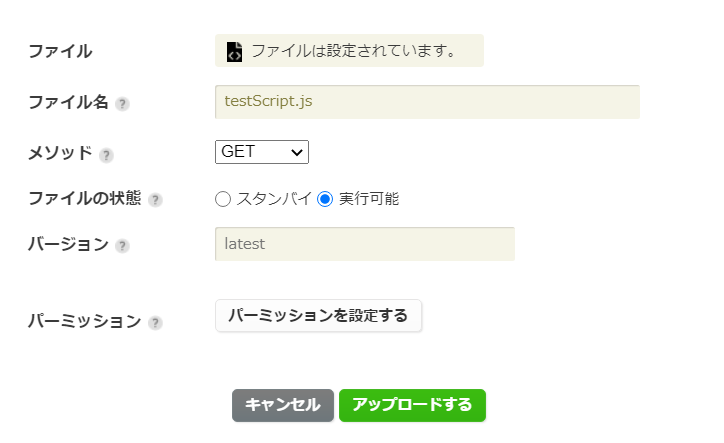
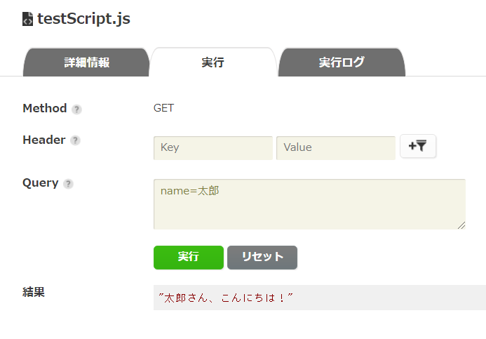
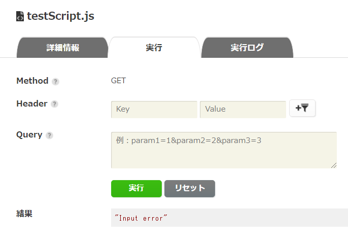
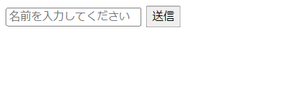
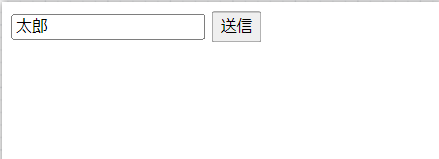
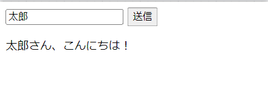

# ScriptQuickStart
【ニフクラ mobile backend スクリプト機能】クイックスタート

## はじめに
mobile backend のスクリプト機能を使ってみたいけどどこから手を付けたらいいものか・・・<br>
という方向けにスクリプト機能Ver.の「クイックスタート」を用意しました。<br>
<br>
手順通り進めるだけで簡単に動作確認が可能なチュートリアル形式です。<br>
<br>
* 所要時間目安： 10分～15分程度

## 事前準備
* 開発環境準備
   * Windows でも Mac でもブラウザとして「Google Chrome」のインストールされていれば利用可能です
* ニフクラ mobile backend アカウント作成 ＞ 下記URLよりSNSアカウントにて登録（無料）
   * https://mbaas.nifcloud.com/doc/current/
* Monaca または Monaca Education アカウント作成 ＞ 下記URLより登録（Freeプランあり）
   * Monaca https://monaca.mobi/ja/signup
   * Monaca Education https://monaca.education/ja/signup
* 任意の「テキストエディタ」をインストール
   *  JSファイル作成に必要です
   *  なんでもOKですが、「Atom」「サクラエディタ」などがおすすめです
   
## 作業内容
1. 管理画面上で動かす（スクリプトの動作テスト）
2. アプリから動かす（スクリプトの実践動作確認）

## 作業手順
### 1.管理画面上で動かす（スクリプトの動作テスト）
スクリプトファイルの準備します。テキストエディタを起動して以下をコピペする
```js
module.exports = function(req, res) {
  var name = req.query.name;
  if ( name == null ) {
    res.status(400);
    res.send("Input error");
  } else {
    res.status(200);
    res.send(name + "さん、こんにちは！");
  }
}
```      
* アプリ側で名前を入力するとサーバー側で「（名前）さん、こんにちは！」という文字列を作成して返却するだけの内容です。

ファイル名を「testScript.js」として任意の場所に保存します。
* 文字コードの指定がある場合は「UTF-8」を選択する
* BOMとかついていると失敗するので気を付ける

mobile backend 管理画面にログインし、アプリを作成します。
* 例）アプリ名「ScriptTestApp」
* 既にアプリが１つ以上存在する場合は「新しいアプリ」をクリックして作成する
* （参考） https://mbaas.nifcloud.com/doc/current/introduction/div_quickstart_javascript_monaca.html#アプリの新規作成

アプリを作成すると管理画面が表示されるので、作成したスクリプトファイルをアップロードします。
* 管理画面を開いて「スクリプト」をクリックする
* 「アップロード」クリックする
* 「ファイルを選択」をクリックして先程任意の場所に保存した「testScript.js」を選択する
* 「メソッド」は「GET」を選択する
* 「ファイルの状態」は「実行可能」を選択する
* 「アップロードする」をクリックする



動作テストをします。
* 一覧から「testScript.js」を選びクリックすると右側に「詳細情報」が表示される
* 「実行」タブをクリックする
* 「Query」に「name=太郎」（太郎のところは自分の名前など自由に設定OK）と入力する
* 「実行」をクリックする
* 正しく作業できていれば「結果」に「"太郎さん、こんにちは！"」と出力される



* 何も入力しないで「実行」をクリックした場合は「"Input error"」（入力エラー）と出ます



* 次の結果が出る場合は、ファイルのデプロイが完了していないため、少し時間をおいてからリトライしてください
```json
{"error":"Script is not yet deployed.","status":409,"code":"E409002"}
```

### 2.アプリから動かす（スクリプトの実践動作確認）

名前をアプリから入力して、スクリプト「testScript.js」を動かし、返却された値をアプリに表示します。

Monacaにログインしてダッシュボードを開き、「新しいプロジェクトを作る」＞「最小限のテンプレート」からプロジェクトを作成します。
* 例）プロジェクト名「スクリプトテスト」

作成したプロジェクトを開き、プロジェクトに JavaScript SDK を導入します
* 導入方法はドキュメントサイトを参照ください
  * https://mbaas.nifcloud.com/doc/current/introduction/div_quickstart_javascript_monaca.html#SDKのインストールと読み込み

「index.html」を開いて、bodyタグを次のように書き換えます。
```html
<body>
    <input type="text" id="name" placeholder="名前を入力してください">
    <input type="submit" onclick="sendName()">
    <p id="res"></p>
</body>
```
* 名前の入力フィールドと送信ボタンの作成

scriptタグも同様に、次のように書き換えます。
```html
<script>        
    var applicationKey = "YOUR_APPLICATIONKEY";
    var clientKey = "YOUR_CLIENTKEY"
    var ncmb = new NCMB(applicationKey, clientKey);

    function sendName() {
        var name = document.getElementById("name").value;
        /* スクリプト実行 */
        ncmb.Script
            .query({"name": name})
            .exec("GET", "testScript.js")
            .then(function(res){
                // スクリプト実行成功時の処理
                console.log(res.body);
                document.getElementById("res").innerHTML = res.body;
            })
            .catch(function(err){
                // スクリプト実行失敗時の処理
                console.log(err);
            });
    }
</script>
```

* L2-3の「YOUR_APPLICATIONKEY」と「YOUR_CLIENTKEY」にはmobile backend でアプリ作成時に払い出されたAPIキーを設定してください
  * （参考） https://mbaas.nifcloud.com/doc/current/introduction/div_quickstart_javascript_monaca.html#アプリの新規作成
* 「送信」ボタンが押されると、入力した名前の値を持ってスクリプト「testScript.js」を呼び出し実行します

動作テストをしましょう。プロジェクトを保存し、プレビュー画面を開きます。
* 名前（任意）を入力します



* 入力したら「送信」ボタンをクリックします



* スクリプトがアプリから実行され、入力した名前が渡されます
* レスポンスとして返却された内容が画面に表示されます


